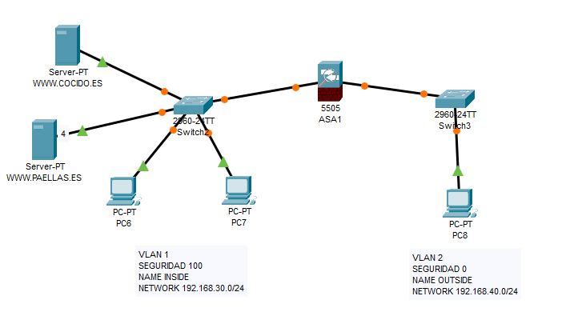

# Configuración de Cortafuegos (ASA)

## Descripción
Implementación de un cortafuegos utilizando un dispositivo Cisco ASA para controlar el tráfico entre dos redes, aplicando diferentes niveles de seguridad y configuraciones de acceso. Se establece una segmentación entre red interna y externa, gestionando el flujo de tráfico mediante políticas de seguridad.

## Topología

## Configuración

El cortafuegos se ha configurado con dos interfaces principales:

### Interfaz interna (inside)
- Dirección IP: 192.168.30.1/24  
- Security level: 100  
- Red considerada de confianza  

### Interfaz externa (outside)
- Dirección IP: 192.168.40.1/24  
- Security level: 0  
- Red considerada no confiable  

## Seguridad implementada

- Segmentación de red mediante niveles de seguridad (inside / outside)  
- Control del tráfico entre redes con diferentes niveles de confianza  
- Asignación de políticas de acceso remoto mediante VPN SSL  
- Gestión de usuarios autenticados para acceso remoto  

## Servicios configurados

- Servidor DHCP en ambas redes:
  - Red interna: 192.168.30.10 – 192.168.30.20  
  - Red externa: 192.168.40.10 – 192.168.40.20  

- Acceso remoto mediante WebVPN:
  - Configuración de group-policies  
  - Definición de usuarios  
  - Acceso a recursos web específicos  

## Verificación

Se ha comprobado el funcionamiento del cortafuegos mediante:

- Asignación correcta de direcciones IP por DHCP  
- Separación efectiva entre red interna y externa  
- Aplicación de políticas de seguridad según nivel configurado  

## Archivos

- `CORTAFUEGOS.pkt` → Simulación en Cisco Packet Tracer  
- `topologia.png` → Diseño de la red  
