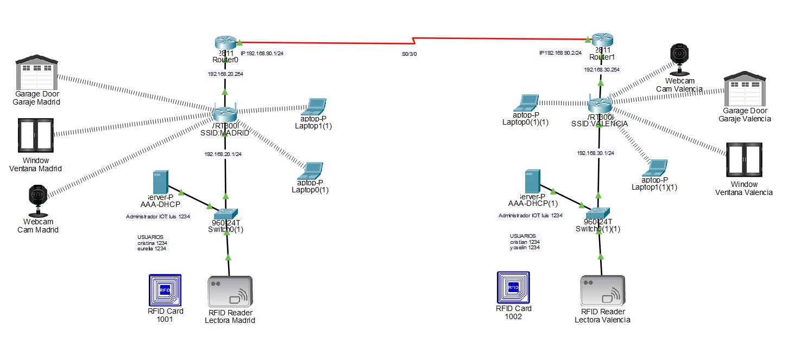

# Proyecto IoT con AAA y DHCP en Cisco Packet Tracer

## Descripción
Este proyecto implementa una red IoT en Cisco Packet Tracer que integra:
- Asignación dinámica de direcciones IP mediante DHCP  
- Autenticación centralizada mediante servidor AAA (RADIUS)  
- Gestión de dispositivos IoT a través de un servidor IoT  

La topología representa un entorno doméstico inteligente (Valencia) con dispositivos conectados inalámbricamente.

## Topología de Red

La red está compuesta por:

- **Router (2811)**  
  - IP: 192.168.30.254  
  - Función: Gateway de la red  

- **Home Gateway / Punto de acceso (RT300N)**  
  - IP: 192.168.30.1  
  - SSID: VALENCIA  
  - Función: Conectividad WiFi para dispositivos IoT  

- **Switch (2960-24TT)**  
  - Interconexión de dispositivos cableados  

- **Servidor (AAA + DHCP + IoT)**  
  - IP: 192.168.30.2  
  - Funciones:
    - Servidor DHCP  
    - Servidor AAA (RADIUS)  
    - Servidor IoT  

## Configuración de Servicios

### DHCP
- Pool: `serverPool`  
- Red: 192.168.30.0/24  
- Gateway: 192.168.30.254  
- Rango de IPs: desde 192.168.30.20  
- Máximo de usuarios: 236  

Permite asignar automáticamente direcciones IP a todos los dispositivos de la red.

### AAA (RADIUS)
- Servicio activado  
- Cliente RADIUS:
  - Nombre: routerV  
  - IP: 192.168.30.1  
  - Clave secreta: 123456789  

- Usuarios configurados:
  - cristian / 1234  
  - yoselin / 1234  

Se utiliza para autenticación centralizada de dispositivos en la red.

### Servidor IoT
- Servicio activado  
- Usuario:
  - luis / 1234  

Permite la gestión remota de los dispositivos IoT registrados.

## Dispositivos IoT

Los dispositivos configurados son:

- Puerta de garaje  
- Ventana  
- Cámara  
- Lector RFID  

### Configuración común:
- Conexión: Wireless (SSID VALENCIA)  
- Dirección IP: DHCP  
- Servidor IoT remoto:
  - IP: 192.168.30.2  
  - Usuario: luis  

## Funcionamiento

1. Los dispositivos IoT se conectan al punto de acceso (RT300N).  
2. Obtienen automáticamente una dirección IP mediante DHCP.  
3. Se registran en el servidor IoT usando credenciales configuradas.  
4. El servidor AAA gestiona la autenticación de acceso.  
5. Desde el servidor se pueden monitorizar y controlar los dispositivos:
   - Apertura/cierre de garaje  
   - Control de ventana  
   - Visualización de cámara  
   - Validación mediante RFID  

## 🎴 Prueba de funcionamiento (RFID)

Se verifica el sistema mediante el uso de una tarjeta RFID:

### 🖼️ Estado del sistema

### 🖼️ Lectura de tarjeta RFID

## Resultados

- Conectividad completa entre todos los dispositivos  
- Asignación automática de IPs funcional  
- Autenticación AAA operativa  
- Control centralizado de dispositivos IoT  
- Monitorización en tiempo real desde el servidor  
