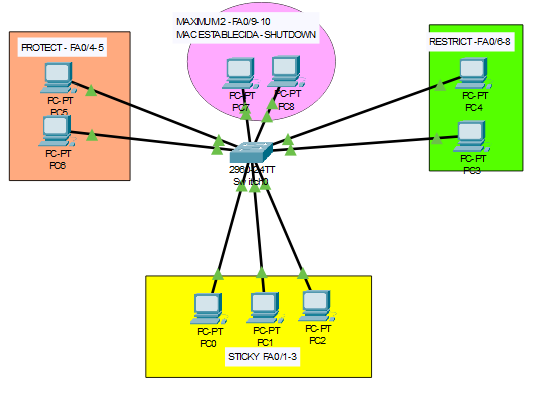
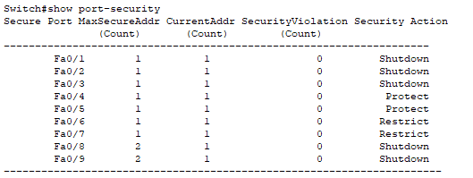

# Seguridad por MAC en Switch (Port Security)

## Descripción
Implementación de control de acceso a red mediante seguridad por direcciones MAC en un switch Cisco, aplicando diferentes configuraciones de port-security para restringir dispositivos no autorizados. 

## Topología

## Configuración

Se han aplicado diferentes configuraciones de port-security en varios puertos del switch:

### Sticky MAC (Fa0/1 - Fa0/3)
- Aprendizaje automático de direcciones MAC  
- Asociación dinámica al puerto  

### Protect (Fa0/4 - Fa0/5)
- Bloqueo silencioso de tráfico no autorizado  
- No genera logs ni desactiva el puerto  

### Restrict (Fa0/6 - Fa0/7)
- Bloqueo de tráfico no autorizado  
- Genera logs y contabiliza violaciones  

### Maximum MAC (Fa0/8 - Fa0/9)
- Límite de direcciones MAC por puerto  
- Permite hasta 2 dispositivos por puerto  

## Seguridad implementada

- Control de acceso basado en direcciones MAC  
- Prevención de dispositivos no autorizados  
- Configuración de diferentes modos de violación  
- Seguridad en capa 2 (switching)  

## Verificación

Se ha comprobado el estado de la seguridad en los puertos del switch mediante comandos de monitorización.

La salida de `show port-security` muestra:

- Direcciones MAC aprendidas correctamente  
- Configuración activa en cada puerto  
- Diferentes modos de seguridad aplicados (protect, restrict, shutdown)  
- Ausencia de violaciones en condiciones normales  

## Archivos

- `EJERCICIO MAC.pkt` → Simulación en Cisco Packet Tracer  
- `topologia.png` → Diseño de la red
- `verificacion.png` → Verificación estado seguridad
