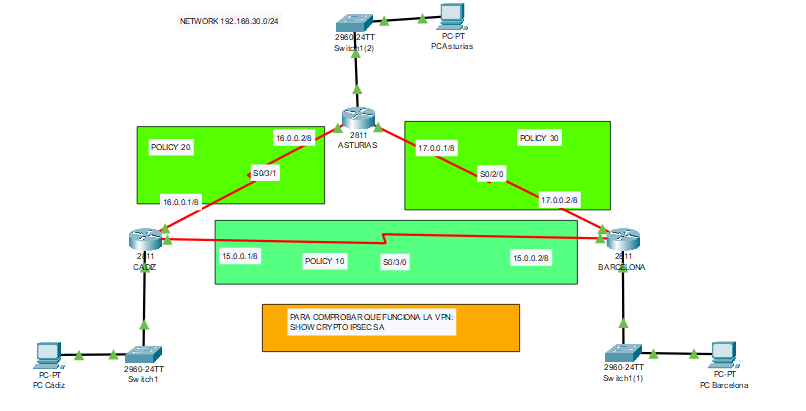

# Implementación de VPN site-to-site con IPsec

## Descripción
Simulación de una red empresarial distribuida en múltiples sedes (Cádiz, Asturias y Barcelona) interconectadas mediante una VPN site-to-site utilizando IPsec.

La comunicación entre redes se asegura mediante cifrado AES-256 y autenticación mediante clave precompartida (PSK), garantizando la confidencialidad del tráfico.

---

## Arquitectura de red

Cada sede dispone de su propia red local:

- Cádiz → 192.168.10.0/24  
- Barcelona → 192.168.20.0/24  
- Asturias → 192.168.30.0/24  

Los routers establecen múltiples túneles VPN entre sí para permitir la comunicación segura entre todas las redes.

---

## 🖼️ Topología

---

## Implementación de seguridad

Se ha configurado una VPN IPsec con las siguientes características:

- Autenticación mediante **pre-shared key (PSK)**  
- Cifrado **AES-256**  
- Hash **SHA**  
- Uso de **ISAKMP (IKEv1)**  
- Configuración de múltiples políticas (policy 10, 20, 30)  
- Definición de tráfico interesante mediante **ACLs**  
- Aplicación de **crypto map** en interfaces serial  

---

## Conectividad entre sedes

Se han establecido túneles VPN entre:

- Cádiz ↔ Barcelona  
- Cádiz ↔ Asturias  
- Asturias ↔ Barcelona  

Esto permite la comunicación segura entre todos los dispositivos de las distintas redes.

---

## Verificación de conectividad

Se ha comprobado la comunicación entre equipos de distintas sedes mediante pruebas de conectividad (ping), verificando el correcto funcionamiento de los túneles VPN.

---

## Resultados

La red permite la comunicación segura entre todas las sedes, asegurando la confidencialidad de los datos transmitidos a través de la VPN.

---

## Conclusión

Este proyecto demuestra la implementación de una arquitectura de red distribuida con comunicación segura mediante VPN IPsec, aplicando conceptos de enrutamiento, control de tráfico y seguridad en redes.

---

## Archivos

- `vpn.pkt` → Simulación completa en Cisco Packet Tracer  
- `topologia.png` → Diseño de la red  
- `ping.png` → Verificación de conectividad  
